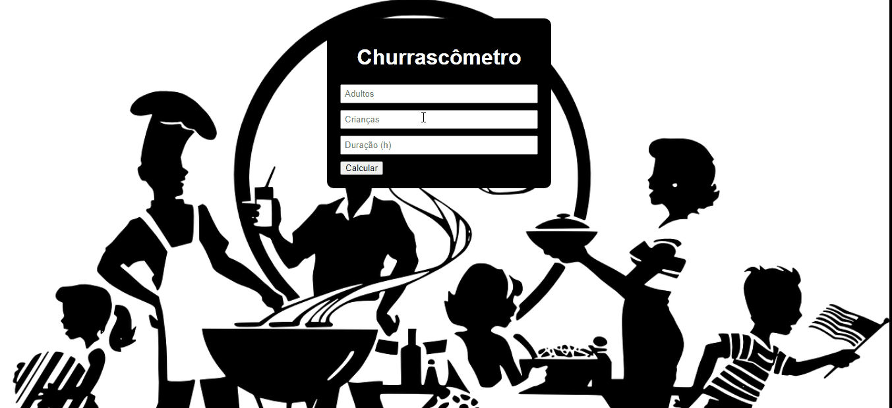
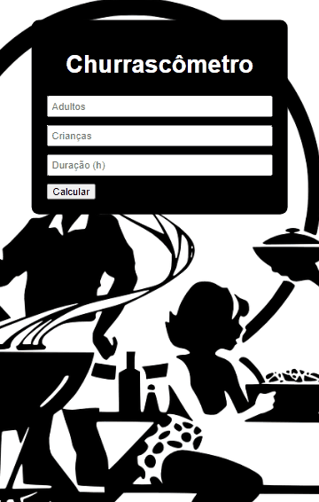

# PROJETO_CHURRASCÔMETRO

Calcular quanto será necessário de carne, cerveja e refrigerante, baseado no número de adultos, crianças incluindo a condição se vai passar de 6 horas, alterar a equivalência.

<i>"Seja bem-vindo" </i> 

  <kbd>
    
  </kbd>
  &nbsp;&nbsp;&nbsp;&nbsp;
  <kbd> 
    
  </kbd>
  &nbsp;&nbsp;&nbsp;&nbsp;

## Tecnologias utilizadas
- HTML
- CSS
- Javascript
   

Made with 💙 by Gustavo Mattos 👋 [See my LinkedIn](https://www.linkedin.com/in/guh-mattos/)